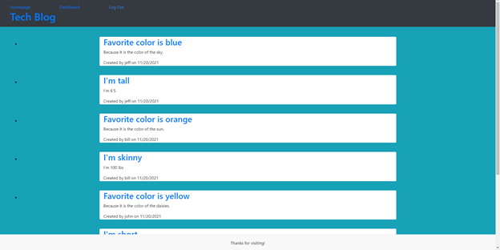

# Tech-Blog

 ## Description:
  A website for developers to blog about specific codes, projects, or about anything they want.  Be able to create, edit, and delete post and comment on other users' posts as well. 

  ## Demo:
   

  ## Built with:
  Node, Express, MySql, Sequelize, and Handlebars.

  ## Website:
  https://github.com/johnrip89/Tech-Blog
  
  https://nameless-gorge-50935.herokuapp.com/

  ## Contribution:
  Made by John Ripplinger